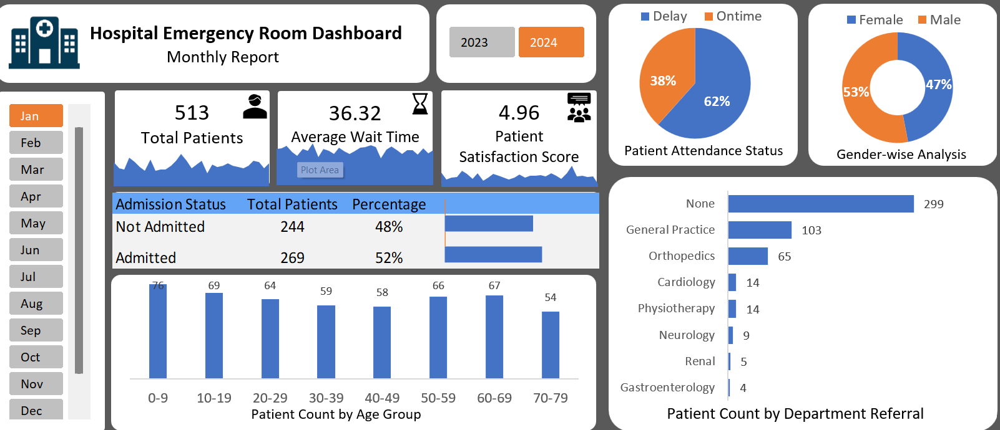

# Hospital-Emergency-Room-Dashboard-Excel
Interactive Hospital Emergency Room Dashboard built in Microsoft Excel.
# 🏥 Hospital Emergency Room Dashboard (Excel)

## 📌 Project Overview

This project is an interactive **Hospital Emergency Room Dashboard** built using **Microsoft Excel**. It provides a comprehensive view of emergency room operations through interactive visualizations and Key Performance Indicators (KPIs), helping users analyze patient flow, waiting times, admissions, referrals, and demographic trends.

---

# 📷 Dashboard Preview



---

# 🎯 Business Objective

The goal of this dashboard is to help hospital administrators and healthcare professionals monitor emergency room performance and make data-driven decisions by answering questions such as:

- How many patients visited the emergency room?
- What is the average patient waiting time?
- What percentage of patients were admitted?
- Which departments received the highest referrals?
- Which age groups visit the emergency room most frequently?
- What is the patient satisfaction score?

---

# 📊 Dashboard Features

- 📅 Interactive Month Slicer
- 📅 Year Filter
- 📈 KPI Cards
  - Total Patients
  - Average Waiting Time
  - Patient Satisfaction Score
- 🏥 Admission Status Analysis
- ⏱️ Patient Attendance Status
- 👨‍⚕️ Department Referral Analysis
- 👩 Gender-wise Analysis
- 👶 Age Group Distribution

---

# 🛠 Tools & Techniques Used

- Microsoft Excel
- Pivot Tables
- Pivot Charts
- Slicers
- Conditional Formatting
- Data Cleaning
- Dashboard Design
- KPI Reporting

---

# 📈 Key Insights

- **Total Patients:** 513
- **Average Waiting Time:** 36.32 Minutes
- **Patient Satisfaction Score:** 4.96 / 5
- **52%** of patients were admitted.
- The **0–9 age group** recorded the highest number of patient visits.
- Most patients **did not require department referrals**.

---

# 📂 Repository Contents

```text
Hospital-Emergency-Room-Dashboard-Excel
│
├── Hospital_Emergency_Room_Dashboard.xlsb
├── Hospital Emergency Room Data.csv
├── dashboard-preview.png
└── README.md
```

---

# 📁 Dataset

**File Name:** `Hospital Emergency Room Data.csv`

The dataset contains patient-level emergency room records used to build the dashboard.

### Sample Fields

- Patient ID
- Gender
- Age
- Admission Status
- Department Referral
- Waiting Time
- Patient Satisfaction Score
- Attendance Status
- Visit Date

---

# 💡 Skills Demonstrated

- Data Cleaning
- Data Analysis
- Data Visualization
- Dashboard Development
- KPI Design
- Interactive Reporting
- Business Intelligence

---

# 🚀 Future Improvements

- Automate data refresh using Power Query
- Build the dashboard in Power BI
- Add department-level drill-down analysis
- Create monthly trend analysis
- Add predictive analytics for patient volume

---

# 👩‍💻 Author

**Prarthana Jadhav**

Aspiring Data Analyst

---

⭐ If you found this project interesting, consider giving it a star!
